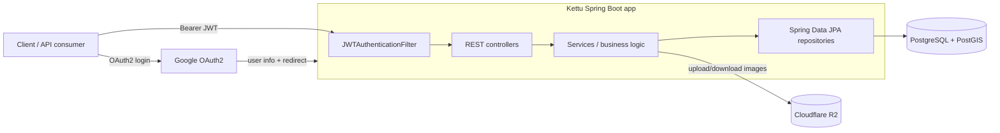
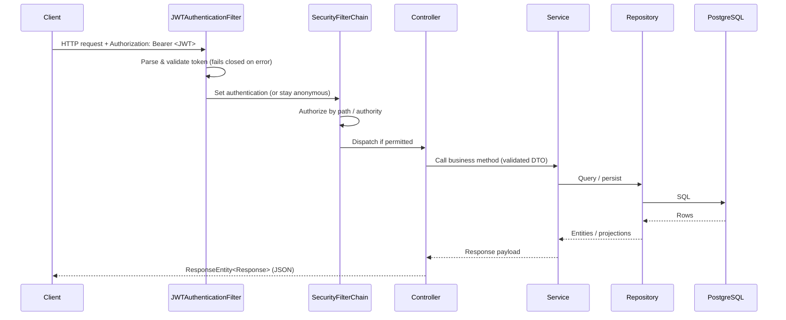

# Architecture

This document describes how Kettu is structured and how a request flows through it.
It reflects the code currently in the repository.

## High-level overview

Kettu is a single-module Spring Boot application exposing a stateless JSON REST API.
Authentication is delegated to Google via OAuth2; after login the service issues a
JWT that clients send on subsequent requests. Persistent data lives in PostgreSQL
(with the PostGIS extension for geometry), and uploaded images are stored in
Cloudflare R2 (S3-compatible) object storage.

## Modules / packages

All code lives under `com.khorunaliyev.kettu`:

| Package        | Responsibility                                                                 |
|----------------|--------------------------------------------------------------------------------|
| `KettuApplication` | Spring Boot entry point (`main`).                                           |
| `config`       | Cross-cutting configuration. Subpackages: `security` (Spring Security, OAuth2, JWT), `adviser` (global exception handling), `auditor` (JPA auditing), `cpu` (async + web MVC), `other` (locale, projections), `r2config` (S3 client), `swagger` (OpenAPI). |
| `controller`   | REST controllers grouped by domain: `auth`, `place`, `geo`, `resource`, `storage`, `user`, plus `HomeController` and `SecureController`. |
| `services`     | Business logic grouped by domain: `place`, `resource`, `geo`, `storage`, `user`. |
| `repository`   | Spring Data JPA repositories grouped by domain: `auth`, `place`, `resource`.    |
| `entity`       | JPA entities: `auth` (AppUser, Role), `place` (Place, PlaceLocation, PlacePhoto, UserActiveUploads), `resources` (Category, Country, Region, District, Tag), `auditing` (FullAuditing base), `enums` (PlaceStatus). |
| `dto`          | Data transfer objects: `request` (validated inbound payloads), `reponse` (outbound responses), `projection` (Spring Data interface projections). |
| `component`    | Reusable helpers: `UserContext`, `ProjectionUtils`, `PlaceDiffChecker`, `UserDiffChecker`. |
| `util/query`   | Native SQL strings (`DistrictQuery`) and JPA `Specification`s (`PlaceSpecification`). |

## Request / data flow

### Authenticated REST request

### OAuth2 login

1. Client hits `/api/auth/login`, which redirects to Google's authorization
   endpoint (`/oauth2/authorization/google`).
2. After consent, Spring Security's OAuth2 client exchanges the code and loads the
   user via `CustomOAuth2UserService`.
3. `CustomOAuth2SuccessHandler` creates or looks up the `AppUser`, generates a JWT
   with `JWTGenerator`, and redirects to `/auth-redirect.html?token=<JWT>`.
4. The client extracts the token and uses it as a `Bearer` credential thereafter.

## Important classes and responsibilities

| Class                                      | Responsibility                                                        |
|--------------------------------------------|----------------------------------------------------------------------|
| `SecurityConfiguration`                    | Defines the security filter chain, authorization rules, OAuth2 login. |
| `JWTAuthenticationFilter`                  | Reads the `Bearer` token, validates it, sets the security context; fails closed. |
| `JWTGenerator`                             | Creates and validates JWTs; secret/expiry are externally configurable. |
| `CustomOAuth2UserService` / `CustomOAuth2SuccessHandler` | Load the OAuth2 user and issue a JWT on success.        |
| `CutomUserDetailsService`                  | Loads `AppUser` by email for authentication.                         |
| `GlobalControllerExceptionHandlerAdvisor`  | Maps exceptions to consistent `Response` payloads; hides internals.  |
| `R2Service`                                | Uploads/downloads/deletes objects in Cloudflare R2.                   |
| `GeoService` / `DistrictRepository`        | Reverse geocoding via PostGIS `ST_Contains`.                          |
| `PlaceService` and the place services      | Create, update, list, and moderate places.                           |
| `AuditorAwareImpl` / `FullAuditing`        | Populate auditing fields on entities.                                 |

## Configuration structure

- `src/main/resources/application.yml` is the single configuration source. All
  secrets are read from environment variables (see [CONFIGURATION.md](CONFIGURATION.md)).
- Database schema is managed by Flyway migrations in
  `src/main/resources/db/migration` (`V1__init_schema.sql`, `V2__add_slug_category_and_tag.sql`).

## External dependencies

- **PostgreSQL + PostGIS** — relational storage and geospatial queries.
- **Google OAuth2** — identity provider for login.
- **Cloudflare R2** — S3-compatible object storage for images.

## Build system

- Gradle with the wrapper (`./gradlew`), the Spring Boot plugin, and the Spring
  dependency-management plugin. Java toolchain is pinned to 21. See
  [build.gradle](build.gradle).

## Testing architecture

- **Unit tests** instantiate classes directly with Mockito mocks; no Spring context
  or database is required. They run in the default `test` task.
- **Integration test** (`KettuApplicationTests`) boots the full context and is
  tagged `integration`; it requires a real database and is run via
  `./gradlew integrationTest`. See [TESTING.md](TESTING.md).

## Known limitations

- No web-layer (MockMvc) or repository (Testcontainers) tests yet; coverage is
  focused on unit-testable logic.
- Some values are hard-coded rather than configurable (the OAuth2 success redirect
  URL and an admin bootstrap email). These are noted in the [roadmap](ROADMAP.md).
- No health/metrics endpoints (Spring Boot Actuator is not a dependency).
- Method-level security annotations (`@PreAuthorize`) appear on `SecureController`;
  whether method security is globally enabled is **not explicitly configured in the
  codebase**, so rely on the URL-based rules in `SecurityConfiguration` as the
  source of truth.
